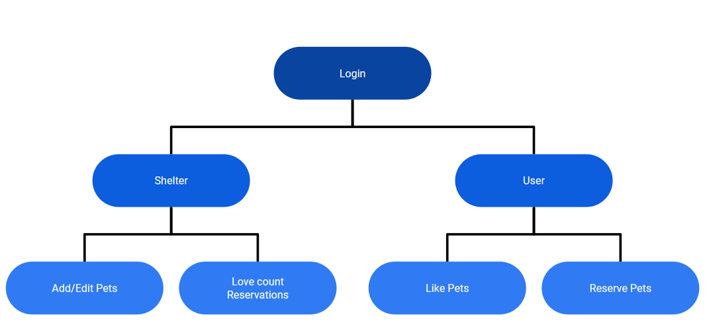
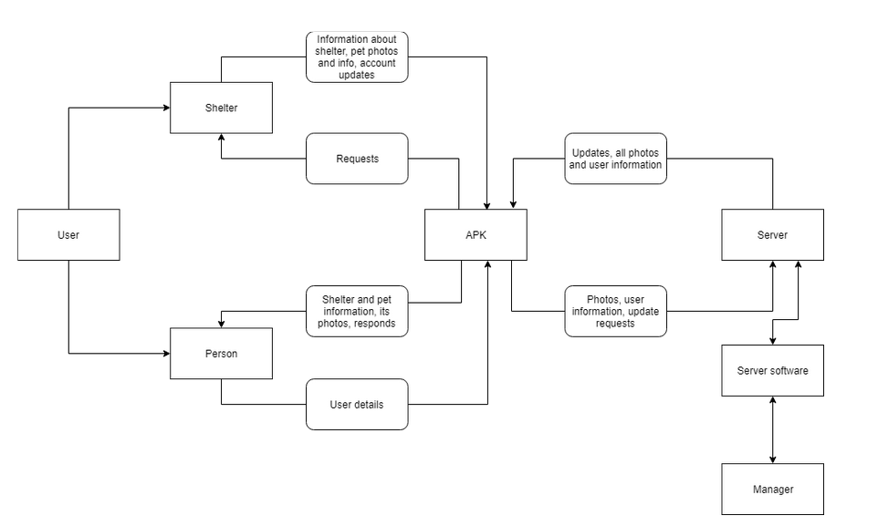
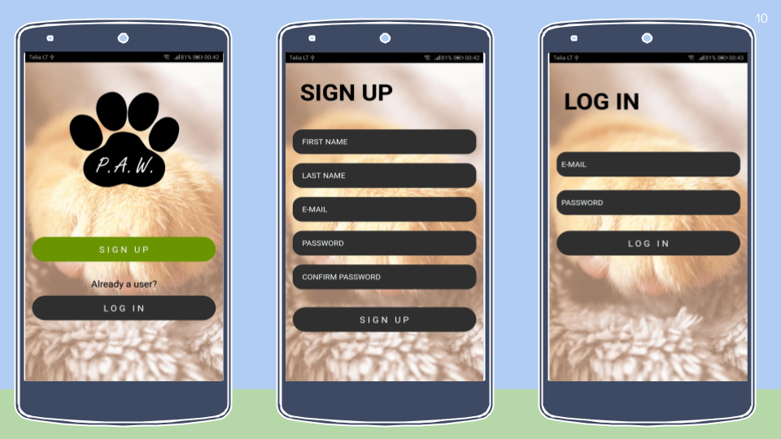
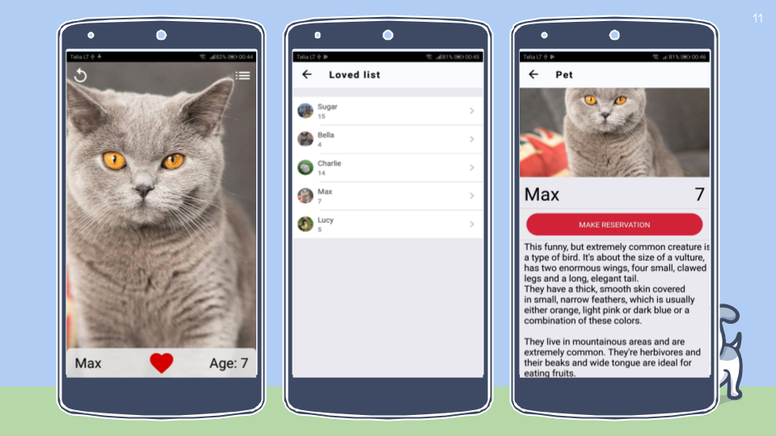
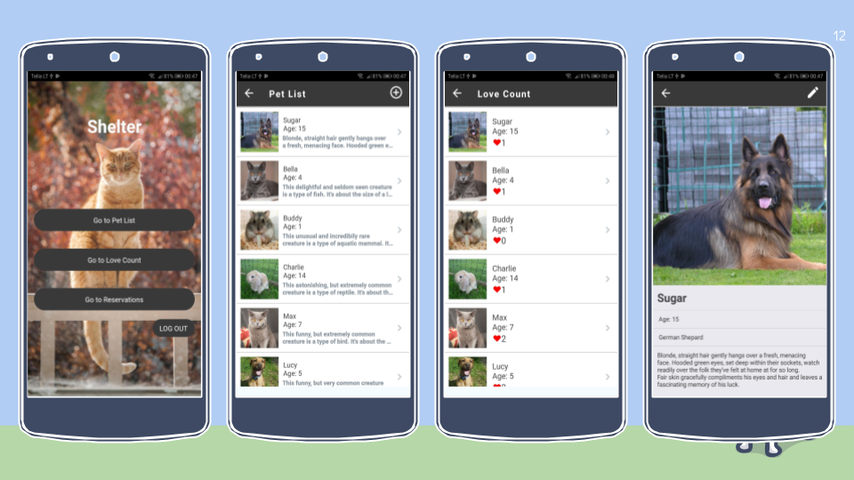
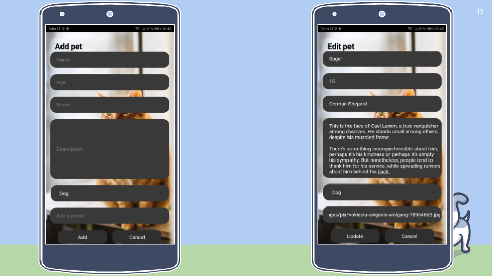
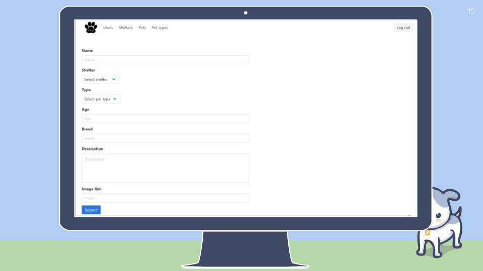
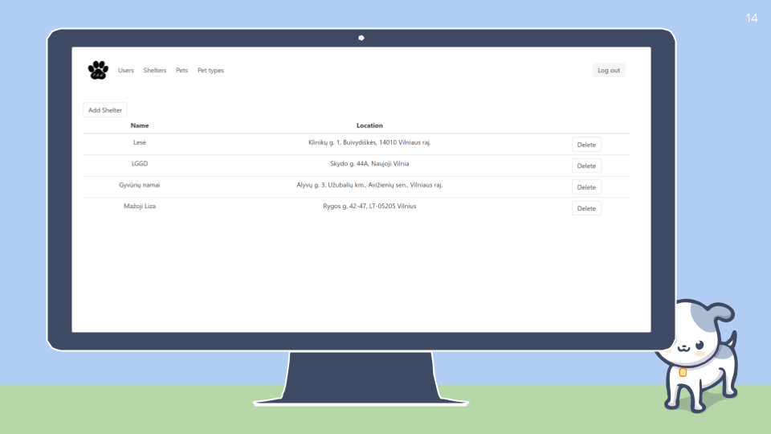

# ProjectApp
## Motivation

This is our first Computer Architecture project.

After Tinder came out it blew up with enormous popularity among both youth and adults. Tinder provided an easy and fun way to find a possible match and maybe even a partner for life.

Overloaded shelters are a rather huge problem and it mainly persists due to lack of tools to advertise our little friends. In Hack4Vilnius 2018, we saw an idea to make a Tinder-like app... but for pets. Even though, we didn't participate in the hackathon itself, this was a perfect idea for the first University project.

## Tools

- **App:** React Native
- **API:** NodeJs (ExpressJS)
- **Database:** MongoDB/Mongoose
- **Admin-panel:** React

## Team

| Žygimantas Augūnas | Ignas Dailydė | Karolis Volungevičius | Povilas Januška | Tomas Dukynas |
| ------------------ | ------------- | --------------------- | --------------- | ------------- |
| Front-End          | Back-End      | Front-End             | Back-End        | Front-End     |
| Documentation      | Documentation | Documentation         | Documentation   | Documentation |
| Testing            | Testing       |                       |                 |               |

## Navigation Model

## Data Flow Scheme

## Example photos

## Documentation

ADMIN PANEL: https://github.com/frix360/paw-admin/

Documentation:

Project Charter: https://docs.google.com/document/d/1OnyhW7dH_zME0k93G6s6qsHn6kC0E9jcCPGhaCodxjg/edit?usp=sharing

Project Plan: https://docs.google.com/spreadsheets/d/1Ne4eriJ9QcXYBmArP95RSa31sM0ml3XavCGNtOTL5W0/edit?usp=sharing

Project Scheme: https://drive.google.com/file/d/1xvjA5RQZ0k4pljAcAn_o5ju4u2L7e0zA/view?usp=sharing
